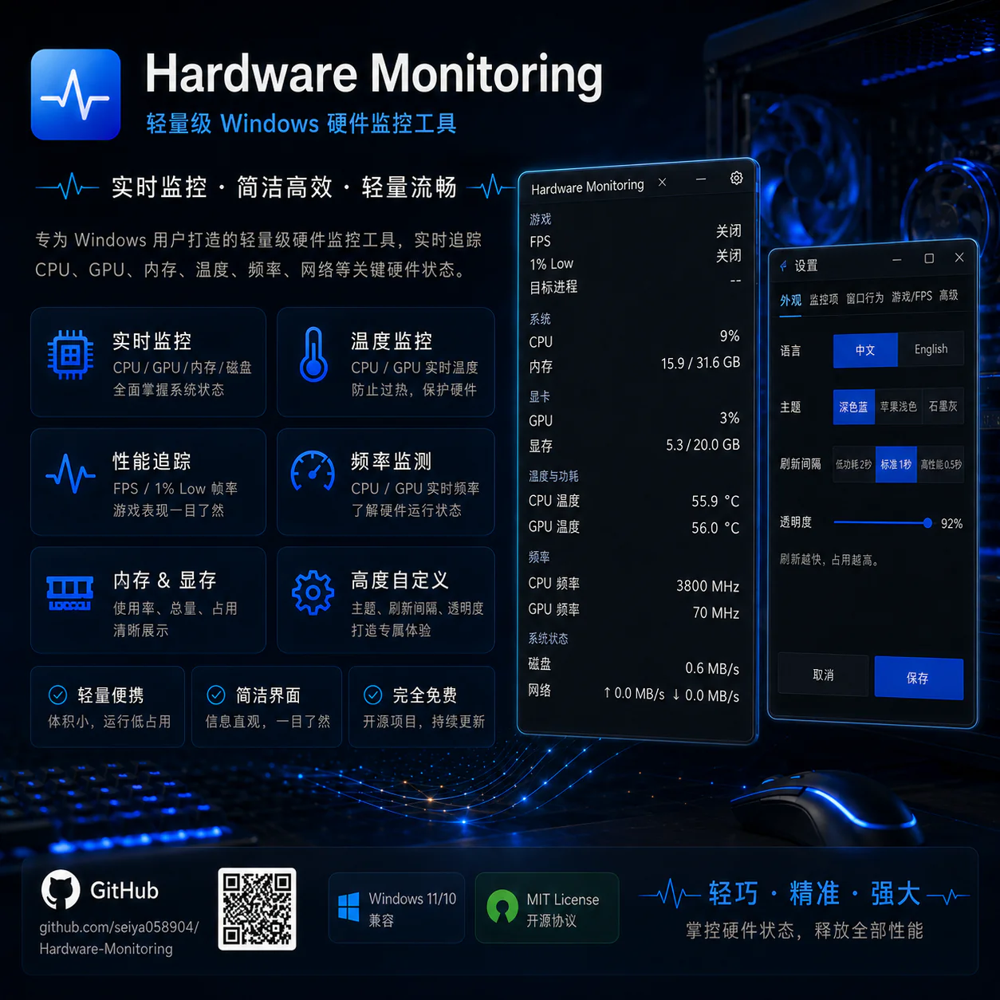
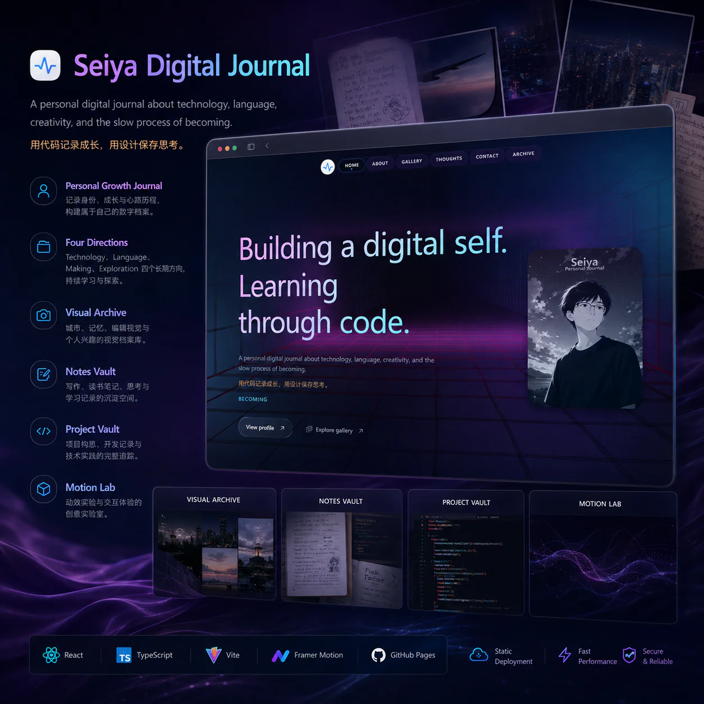
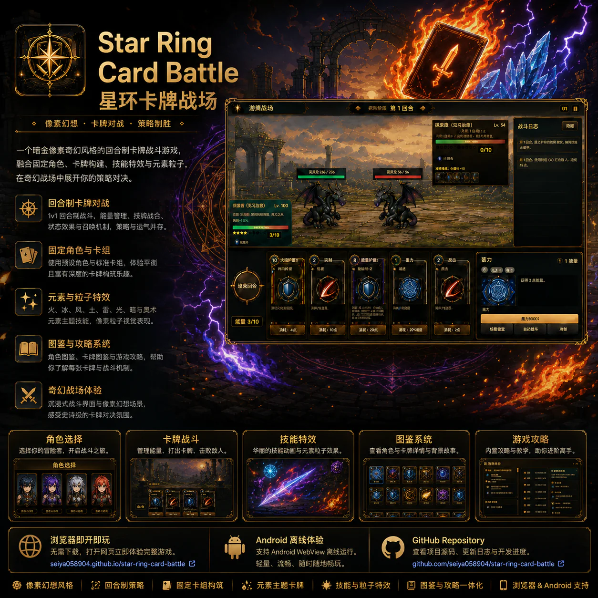

  
  

  <a href="https://seiya058904.github.io/">Personal website</a>
  ·
  <a href="https://github.com/seiya058904?tab=repositories">All repositories</a>
  ·
  <a href="https://github.com/seiya058904/seiya-digital-journal">Digital journal</a>
  ·
  <a href="mailto:sunmengsaiyi@gmail.com">Email</a>

## What I build

I build small software products across Windows utilities, browser experiences, and interactive experiments. My work moves between practical tools, expressive interfaces, and games — with an emphasis on clear product behavior, local-first workflows, and visual detail.

## Featured projects

<table>
  <tr>
    <td width="50%" valign="top">
      
      <h3><a href="https://github.com/seiya058904/Hardware-Monitoring">Hardware Monitoring</a></h3>
      
A lightweight Windows monitor for CPU, GPU, memory, temperatures, FPS, and other live system signals.

      
Python · Windows · Performance monitoring

      
<a href="https://github.com/seiya058904/Hardware-Monitoring/releases/latest">Download the latest release →</a>

    </td>
    <td width="50%" valign="top">
      
      <h3><a href="https://github.com/seiya058904/seiya-digital-journal">Seiya Digital Journal</a></h3>
      
A visual journal and personal archive built around identity, growth, motion, and storytelling.

      
React · TypeScript · Vite · Supabase

      
<a href="https://seiya058904.github.io/seiya-digital-journal/">Open the live experience →</a>

    </td>
  </tr>
  <tr>
    <td width="50%" valign="top">
      
      <h3><a href="https://github.com/seiya058904/INSTANCE">INSTANCE</a></h3>
      
A choice-driven narrative game where authored responses shape recurring conversations and hidden arcs.

      
React · TypeScript · Vite · Narrative systems

      
<a href="https://seiya058904.github.io/INSTANCE/">Play INSTANCE →</a>

    </td>
    <td width="50%" valign="top">
      
      <h3><a href="https://github.com/seiya058904/star-ring-card-battle">Star Ring Card Battle</a></h3>
      
A dark-gold fantasy card battle prototype with fixed decks, elemental effects, and an Android WebView wrapper.

      
HTML · CSS · JavaScript · Kotlin · Android

      
<a href="https://seiya058904.github.io/star-ring-card-battle/">Play in the browser</a> · <a href="https://github.com/seiya058904/star-ring-card-battle/releases/latest">Latest release →</a>

    </td>
  </tr>
</table>

## Technical focus

<table>
  <tr>
    <td valign="top" width="33%"><strong>Languages</strong> Python · JavaScript · TypeScript · Kotlin · HTML · CSS · PowerShell</td>
    <td valign="top" width="33%"><strong>Frontend</strong> React · Vite · Vue · Framer Motion · Three.js</td>
    <td valign="top" width="33%"><strong>Data & delivery</strong> Supabase · Cloudflare Workers · GitHub Actions · Git · Android</td>
  </tr>
</table>

## How I work

- Product first: make the core interaction understandable before adding surface area.
- Small and reversible: keep experiments, platform adapters, and release work easy to inspect.
- Evidence-led: use tests, live demos, screenshots, and release artifacts to check what actually works.

  
More projects

  - [DiskPulse](https://github.com/seiya058904/DiskPulse) — an offline Windows disk-capacity and directory-change dashboard, with installer releases and optional AI explanation.
  - [Relax Block Puzzle](https://github.com/seiya058904/Relax-Block-Puzzle) — a three-platform block puzzle workspace spanning WeChat Mini Game, Android, and Web.
  - [Wolf-Notes](https://github.com/seiya058904/Wolf-Notes) — a local-first werewolf-game notebook with round records and AI prompt generation.
  - [NutriFlow](https://github.com/seiya058904/NutriFlow) — a browser-based daily nutrition and weight tracker with import, export, trends, and light/dark themes.
  - [Worlds](https://github.com/seiya058904/Worlds) — a Git-managed Markdown worldbuilding archive.
  - [Personal website](https://github.com/seiya058904/seiya058904.github.io) — a GitHub Pages site for projects, web presentations, and interactive experiments.

## Activity

  
  

<a href="https://github.com/seiya058904">Explore the rest of the work on GitHub →</a>

